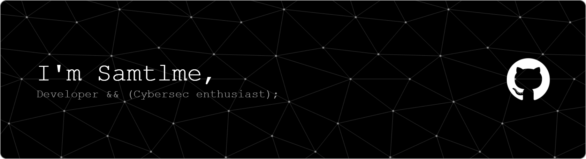

<h3 align="center">Software Development Student💻👨‍💻  |  Cybersecurity enthusiast 🔐👾</h3>

<h3 align="left">Connect with me:</h3>

  

<h3 align="left">Languages and Tools:</h3>

 
   
   
   
   
   </a> 
   
   
   
  <a href="https://www.docker.com/" target="_blank" rel="noreferrer"> 
     

  

